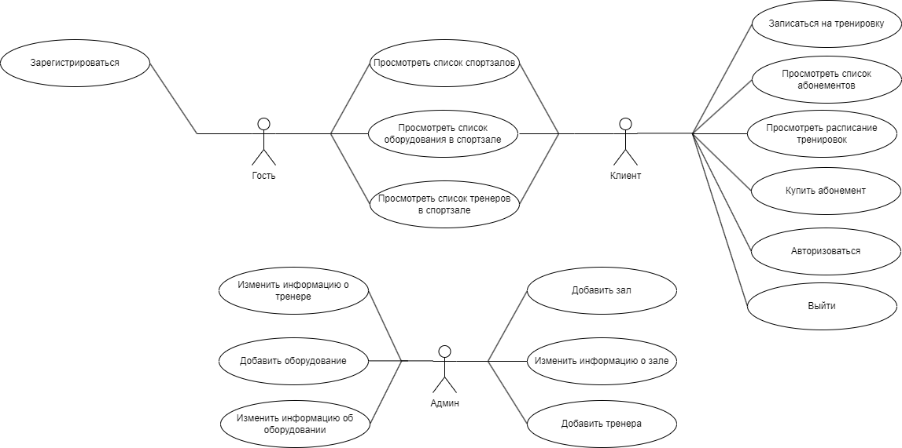
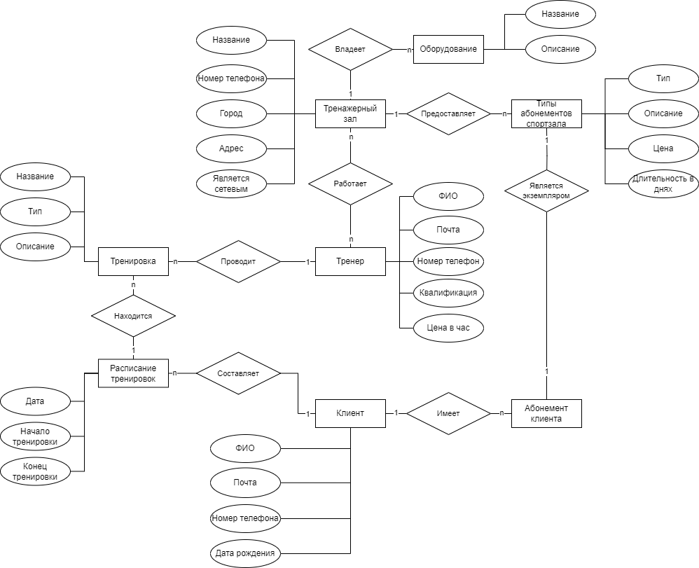
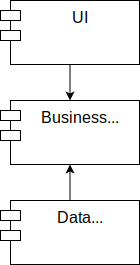
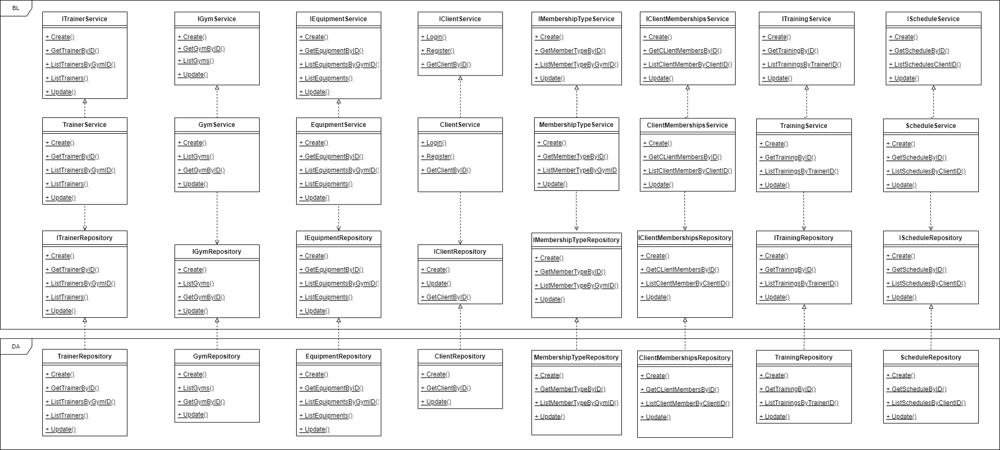

# Проектирование программного обеспечения

## Автор
Тарба Александр Вячеславович
__________
## Название проекта
Интернет-сервис сети тренажерных залов
__________
## Краткое описание идеи проекта
Сервис, предоставляющий пользователям просматривать информацию о спортзалах, их расположении, контактной информации и оборудовании, установленном в них, а так же о тренерах. Пользователи имеют возможность создать личный кабинет, что позволяет им просмотравить их абонементы и записи на тренировки.
__________
## Краткий анализ анологичных решений
|Решение|Личный кабинет|Информация об абонементах|Информация о тренерах|Раписание тренировок|
|---|---|---|---|---|
|World class|+|-|+|+|
|spiritfit|+|+|-|+|
|UFC gym|+|-|-|-|
__________
## Краткое обоснование целесообразности и актуальности проекта
Посещение тренажерных залов на сегодняшней день является важным аспектом жизни многих людей, что позволило им занять свою нишу на рынке услуг. 
В связи с постонно растущим спросом на услуги спортивных центров, разработка приложения, использующего базу данных, для обеспечения работы сети тренажерных залов имеет важное значение для оптимизации управления и предоставления лучшего опыта как для клиентов, так и для персонала зала. 
Автоматизация процесса хранения данных позволяет упростить процесс аналитики и отчетности для владельцев бизнеса, и повысить качество предоставляемого сервиса для клиентов.
__________
## Краткое описание акторов
|Роль|Описание|
|-|-|
|Гость|Неавторизованный посетитель сайта. Может зарегистрироваться, просмотреть список спортзалов, тренеров и оборудования|
|Клиент|Пользователь, зарегистривоваший аккаунт. Может делать то же, что и гость, а также купить абонемент, просмотреть купленные абонементы, записаться на тренировку и просмотреть расписание тренировок. Также может авторизоваться и выйти из аккаунта|
|Админ|Вносит и изменяет информацию об спортзалах,оборудовании и тренерах|
__________
## Usecase-диаграмма
Изображение в svg формате хранится в репозитории

__________
## ER-диаграмма сущность-связь
Изображение в svg формате хранится в репозитории

__________
## Пользовательские сценарии
1. Сценарий просмотра тренажерных залов
   - пользователь заходит в систему;
   - переходит на вкладку "Залы";
   - просматривает содержимое страницы.
2. Сценарий регистрации
   - пользователь заходит в систему;
   - переходит на страницу регистрации;
   - заполняет данные;
   - валидация данных;
   - при успешной валидации, регистрация пользователя и перенаправление его на другую страницу, иначе сообщение пользователю об ошибке.
2. Сценарий входа в личный кабинет
   - пользователь заходит в систему;
   - переходит на страницу авторизации;
   - вводит логин и пароль;
   - при успешной проверке, авторизация пользователя и перенаправление его на другую страницу, иначе сообщение пользователю об ошибке.
3. Сценарий просмотра абонементов
   - пользователь заходит в систему;
   - авторизуется;
   - переходит на вкладку "Ваши абонементы";
   - просматривает доступные абонементы и информацию о них;
4. Сценарий покупи абонементов
   - пользователь заходит в систему;
   - авторизуется;
   - переходит на вкладку "Залы";
   - выбирает интересущий зал и переходит на его страницу;
   - просматривает список абонементов зала, выбирает нужный;
   - покупает выбранный абонемент.
5. Сценарий просмотра тренировок
   - пользователь заходит в систему;
   - авторизуется;
   - переходит на вкладку "Ваши тренировки";
   - просматривает расписание тренировок и информацию о них;
6. Сценарий записи на тренировку
   - пользователь заходит в систему;
   - авторизуется;
   - переходит на вкладку "Залы";
   - выбирает интересущий зал и переходит на его страницу;
   - просматривает список трениров зала, выбирает нужного;
   - записывается у тренера на тренировку.

__________
## Формализация ключевых бизнес-процессов

__________

## Тип приложения
WEB SPA
__________
## Технологический стек
- Backend: Go
- Frontend: HTML, CSS, JS
- Database: PostgreSQL, Redis
- Другое: NGINX, CI/CD, Docker 
__________
## Верхнеуровневое разбиение на компоненты
### Верхнеуровневая схема разбияния на компоненты

### Ожидаемые пакеты
- Слой BL:
  - package entity - сущности предметной области
  - package service - бизнес-правила приложения + интерфейсы репозиториев для соблюдения инверсии зависимостей
- Слой DA:
  - package repository - реализация паттерна репозиторий
  - package db_models - модели базы данных, предполагается использовать ORM
- Слой UI:
   - package handlers - обработчики HTTP запросов "ручек"
   - package server - сервер, принимающий запросы
   - package api - основное приложение, предоставляющее API сервиса (запускает сервер)

Также возможно написания дополнительных пакетов, например, читающих конфиги, хеширующие пароли, валидаторы и так далее.
__________
## UML-диаграмма классов
Изображение в svg формате хранится в репозитории

## Портреты пользователей
1. Портрет: Начинающий пользователь

    Возраст: 18-25 лет.
    Цели: Впервые начать заниматься спортом, выбрать ближайший зал, записаться на пробные тренировки.
    Устройства: Мобильный телефон, планшет.

Юзкейсы:

    Регистрация в приложении:
        Цель: Создать аккаунт, чтобы получить доступ к функциям приложения.
        Сценарий:
            Открыть приложение.
            Перейти на экран регистрации.
            Ввести имя, email, пароль.
            Подтвердить регистрацию и войти в систему.

    Просмотр списка залов:
        Цель: Найти зал поблизости с подходящими условиями.
        Сценарий:
            Перейти на главную страницу.
            Воспользоваться поиском или фильтрами (по местоположению, услугам).
            Открыть страницу выбранного зала.

    Запись на тренировку с тренером:
        Цель: Записаться на тренировку, чтобы попробовать занятия.
        Сценарий:
            Открыть страницу зала.
            Выбрать тренера.
            Найти доступную тренировку в расписании.
            Нажать кнопку "Записаться".

2. Портрет: Активный пользователь

    Возраст: 26-35 лет.
    Цели: Регулярные тренировки, отслеживание записей, продление абонементов.
    Устройства: Мобильный телефон, ноутбук.

Юзкейсы:

    Покупка абонемента:
        Цель: Купить новый абонемент, чтобы продолжать тренироваться.
        Сценарий:
            Перейти на страницу выбранного зала.
            Открыть раздел "Абонементы".
            Выбрать подходящий абонемент.
            Подтвердить покупку.

    Запись на тренировку:
        Цель: Быстро записаться на тренировку в своем любимом зале.
        Сценарий:
            Перейти в раздел "Профиль".
            Открыть список доступных тренировок для текущего абонемента.
            Выбрать тренировку и записаться.

    Просмотр информации о тренере:
        Цель: Узнать больше о тренере перед записью.
        Сценарий:
            Открыть страницу зала.
            Перейти в раздел "Тренеры".
            Нажать на карточку тренера, чтобы открыть его профиль.

3. Портрет: Пользователь с конкретной целью

    Возраст: 30-45 лет.
    Цели: Найти тренера для персональных тренировок, отслеживать посещения.
    Устройства: Мобильный телефон, планшет.

Юзкейсы:

    Поиск тренера по специализации:
        Цель: Найти тренера, который подходит для персональных целей (например, похудение, набор массы).
        Сценарий:
            Перейти на главную страницу.
            Открыть страницу конкретного зала.
            Перейти в раздел "Тренеры".
            Использовать фильтр по специализации и выбрать тренера.

    Запись на тренировку:
        Цель: Забронировать тренировку с выбранным тренером.
        Сценарий:
            Открыть страницу выбранного тренера.
            Перейти в раздел "Расписание".
            Найти подходящее время.
            Нажать кнопку "Записаться".

    Просмотр информации о текущих записях и абонементах:
        Цель: Узнать, какие тренировки запланированы и какой абонемент активен.
        Сценарий:
            Перейти в "Профиль пользователя".
            Открыть раздел "Мои абонементы".
            Просмотреть информацию о записях и активных тренировках.
